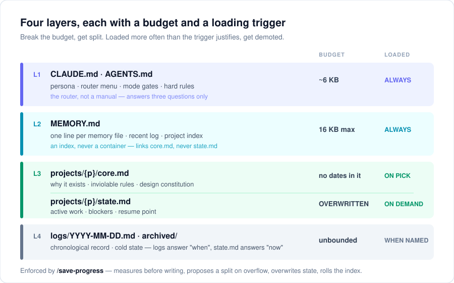

# claude-memory-os

**給 [Claude Code](https://claude.com/claude-code) 用的檔案式記憶／專案作業系統。**

Claude Code 給了你 `CLAUDE.md` 和一套記憶系統，但沒告訴你該怎麼組織它們——
於是大多數人的結局都一樣：一個專案一個檔、只增不刪，直到每次對話都要載入兩萬個
token 的「三月已經修好的 bug」。

這個 repo 就是修正它的結構，抽取自一套連續運行半年、同時管十幾個專案的實戰設定。

> **v0.2.0（2026-09-14）**——以 Claude Code 2.1.252 重新總檢視。路由檔和索引不再
> 重複同一份資訊（原始設定的常載量 −34%）、索引行改成觸發詞、存檔指令每次都回報
> 索引大小，Codex 支援移到獨立 repo。
> **[改了什麼、為什麼改 →](CHANGELOG.md)**（英文）

[English → README.md](README.md)

---

## 只有一個核心想法

> **把「每次都必須載入的」和「按需才載入的」分開，並且用一個例行程序強制執行這條界線。**

其他所有設計都是從這句話長出來的。



每一層都有**位元組預算**和**載入觸發條件**。超出預算就拆檔；被載入的頻率高過
它該有的觸發條件，就降級。

| 層 | 檔案 | 預算 | 何時載入 |
|---|---|---|---|
| **L1** | `CLAUDE.md` | ~6 KB | 永遠 |
| **L2** | `MEMORY.md` | 上限 16 KB | 永遠 |
| **L3** | `core.md` ／ `state.md` | 無日期／覆寫式 | 選定專案時／按需 |
| **L4** | `logs/` ＋ `archived/` | 無上限 | 只有指名 |

---

## Claude Code 原生做了什麼——這套又多了什麼

Claude Code 從 v2.1.32 起有自己的記憶系統：工作時自動記錄與召回記憶、維護一份
`MEMORY.md` 索引、在檔案上標 `modified` 時間戳；v2.1.186 起索引快滿時會提醒
agent 壓縮，v2.1.210 起索引超限（25 KB／200 行）會直接報錯，不再默默截斷。

所以如果你在兩者之間取捨，誠實的對照是：

| | 原生記憶 | 這個 repo |
|---|---|---|
| 記錄與召回記憶 | ✅ | 建立在它之上 |
| `MEMORY.md` 索引＋大小限制 | ✅ | 建立在它之上 |
| 常載／按需載入的分層 | ❌ | **L3 `core`／`state`** |
| 「什麼時候發生了什麼」的時序紀錄 | ❌ | **L4 `logs/`** |
| 一個專案按職責拆區 | ❌ | **SRP 分區** |
| 結案專案的冷凍與解凍 | ❌ | **冷凍狀態** |
| **誰決定什麼值得記住** | agent | **你** |

最後一列才是重點。

### Commit 閘門

原生記憶的預設是「**看起來有用的就記住**」。這個 repo 的預設正好相反：
**全部丟棄，只保留你刻意 commit 的。**

`/save-progress` 不是存檔程序，它是 `commit`。

一個 session 就是一個 working tree。裡面大部分東西本來就是草稿——放棄的分支、
沒走通的做法、為了確認某件事打開一次的檔案。那些不是「遺失的記憶」，而是**本來
就不該存在的記憶**，session 結束時就該蒸發。

這也是為什麼這個指令是手動的，而且會一直是手動的。跟 `git commit` 必須手動是
同一個理由：**「什麼值得進歷史」是人的判斷**，自己觸發的程序做不到。把
`/save-progress` 自動化不會讓這套系統更好——只會拿掉整套系統賴以成立的那個性質。

如果你希望 agent 自己多記一點，你要的是原生記憶，直接用它就好。
如果你希望自己決定，你要的是一道閘門。

---

## 你實際會拿到什麼

### 1. 永不重複索引的路由層

`CLAUDE.md` 只放「**在哪裡都成立、很少變動**」的東西：我在跟誰講話、對話怎麼開場、
哪些能力要設閘門、哪些規則不可違背。

每次新對話一開始，助理主動遞出活躍專案的選單，你只要「指」就好。這是把「回想」
換成「辨認」——第 12 個專案跟第 1 個一樣好取用。**但選單的內容放在 `MEMORY.md`，
不放在路由檔。** 兩個檔每次 session 會一起載入；同一件事兩邊都寫，就要付兩次錢，
而且遲早兩邊會互相矛盾。

> **規則：同一件事，只准存在兩個檔的其中一個。**

### 2. core / state / archived 三層拆檔

| | `core.md` | `state.md` | `archived/` |
|---|---|---|---|
| **放什麼** | 為何存在、鐵則、設計憲法 | 當前工作、阻塞、續接點 | 歷史狀態快照 |
| **寫入方式** | 很少動，戰略轉向才改 | **每階段覆寫** | 新增帶日期的檔 |
| **何時載入** | 選定專案時 | 按需 | 只有指名 |
| **判斷標準** | 「一年後還成立嗎？」 | 「30 天後還重要嗎？」 | 「還能解釋什麼嗎？」 |

真正撐起整套系統的是**寫入方式**。`state.md` 是**覆寫、絕不追加**；舊狀態要嘛
移進 `archived/`，要嘛直接刪掉——日誌已經記過了，存兩份才是 bug，不是保險。

### 3. 由觸發詞組成的索引

`MEMORY.md` 一個檔一行，每一行是**觸發詞，不是摘要**：讓助理認得出話題的關鍵詞，
加上任何**未結案的鉤子**——「卡在 X」「待決定」「結果還沒出來」。不寫解釋，那是
連結過去的檔案該做的事。每行約 120–180 bytes。

**砍到最短也要留住鉤子。** 只剩檔名的索引行，在你直接點名專案時照樣能用；
但對話只是**擦到**那個話題、沒點名時，是鉤子讓助理意識到「這件事還沒結案」。

### 4. `/save-progress`——強制執行迴圈

靠自律維持的架構一定會腐化。這套用一個指令來強制執行，在 session 產出了值得保留的
東西時跑：

- **Step 0**：寫入前先量目標檔。超標 → 提案拆檔，讓你自己決定現在拆還是延後
- **Step 0.5**：**每次都印出索引大小**，不是超標才講。超標 → 提案跨月歸檔、修短行
- **Step 1–5**：覆寫 `state.md`、寫當日日誌、更新索引，最後告訴你下次從哪繼續

Step 0 之所以存在，是因為**這個指令的第一版正是它現在在防的那場膨脹的元凶**。
Step 0.5 改成無條件印出，是因為條件式的舊版讓索引停在 16,003 bytes——超過
16,000 的上限——卻沒有人發現。

### 5. Feedback 檔案——讓糾正活得比對話久

當你糾正的是助理「怎麼做事」而不是「做出什麼」，那條糾正就該變成一個小小的、
永遠載入的檔案：規則 ＋ 背後的事件 ＋ 怎麼套用。

那個 **Why** 不是裝飾。有記錄理由的規則，日後情況改變時可以重新評估；沒有理由的
規則會變成 cargo cult，最後被忽略。

### 6. 分區（Zoning）——專案大到一個檔裝不下時

當一個「專案」其實是好幾份工作共用一個名字，就把它拆成各自單一職責的分區，
並遵守三條規則：**事實下沉**到共用目錄、**狀態歸屬看誰在推進**、
**跨區只放連結永不複製**。

詳見 [docs/srp-zoning.md](docs/srp-zoning.md)。

---

## 安裝之前：這套架構依賴的那個習慣

這裡每一條預算，都由**一個指令**在強制執行：

```
/save-progress
```

在任何**產出了你想保留的東西**的 session 結束時跑它。**你刻意不存的 session，
是設計在正常運作**——那就是 commit 閘門。真正會弄壞系統的，是你**本來想留**的
session 卻沒跑：`state.md` 永遠不會被覆寫、索引永遠不會跨月歸檔、沒有東西會進
`archived/`——大約六週後，你會抵達的正是這個 repo 想防止的那個肥大單一檔案，
只是多了一份寫得很好、解釋你本來該怎麼做的文件。

**結構本身不是系統，結構加上那個習慣才是。** 如果你確定自己不會跑它，
原生的 `CLAUDE.md` 才是誠實的選擇，這套只會變成負擔。

## 先看填好的樣子

`template/` 裡全是佔位符，光看很難想像。
**[examples/](examples/)** 是同一套架構、為一位虛構開發者（用了三個月）**完整填好**
的版本——指向索引的路由檔、由觸發詞組成的索引、一份**沒有任何日期**的 `core.md`、
一份寫著真實續接點的 `state.md`、一份歸檔的決策紀錄，以及一份**寫出事發經過**的
feedback 檔。

先讀那個，複製的時候用 `template/`。

## 安裝

```bash
git clone https://github.com/Lai-Sheng/claude-memory-os.git
cd claude-memory-os
```

### 第 1 步——複製檔案

記憶**放哪都可以**——路徑是在路由檔裡宣告的，沒有什麼神祕目錄要你去找。
以下指令用 `~/AgentMemory`。

**macOS / Linux**

```bash
mkdir -p ~/AgentMemory ~/.claude/commands
cp template/CLAUDE.md     ~/.claude/CLAUDE.md
cp template/commands/*.md ~/.claude/commands/
cp -r template/memory/.   ~/AgentMemory/
```

**Windows PowerShell**

```powershell
New-Item -ItemType Directory -Force ~\AgentMemory, ~\.claude\commands | Out-Null
Copy-Item template\CLAUDE.md ~\.claude\CLAUDE.md
Copy-Item template\commands\*.md ~\.claude\commands\
Copy-Item -Recurse -Force template\memory\* ~\AgentMemory\
```

⚠️ 已經有 `CLAUDE.md` 了？請**合併**，不要直接覆蓋。

### 第 2 步——告訴路由層記憶在哪 🚨

打開 `~/.claude/CLAUDE.md`，把 **§0** 裡的 `{{MEMORY_ROOT}}` 換成你剛才用的絕對
路徑。`~/AgentMemory/README.md` 也要改。

**§0 是記憶層會不會被載入的關鍵，不要刪掉它。** 少了它，agent 會只憑路由檔回答、
安靜地跳過記憶——看起來一切正常，直到它推翻你上週記錄過的決定。

### 第 3 步——填完其餘欄位，然後自檢

在 `CLAUDE.md` 填好人設，在 `MEMORY.md` 的 **Projects** 區填你的專案（路由層的
選單就是從這裡讀的），再填 `user_profile.md`。然後確認沒有漏填的：

```bash
grep -rn "{{" ~/.claude/CLAUDE.md ~/AgentMemory/
```

```powershell
Get-ChildItem -Recurse -File ~\.claude\CLAUDE.md, ~\AgentMemory | Select-String -SimpleMatch "{{"
```

**印出來的每一行都是你還沒填的佔位符。** 印不出東西以後，從
`template/memory/projects/_project_template/` 複製出第一個專案，下一個值得保留的
session 結束前跑一次 `/save-progress`。

完整步驟：**[docs/getting-started.md](docs/getting-started.md)**

> **想用 Claude Code 原生的記憶目錄？** 也可以把 `{{MEMORY_ROOT}}` 指向
> `~/.claude/projects/<workspace>/memory/`，用 `ls -d ~/.claude/projects/*/`
> 找出你的那個，好處是多了原生 25 KB／200 行的保險。**但那個目錄是跟著
> 「你從哪個資料夾啟動 Claude Code」走的**：換個資料夾開 session，拿到的就是
> 另一份、可能是空的記憶。自己選的路徑在哪裡都一樣，也比較好備份。

---

## 文件

| 文件 | 內容 |
|---|---|
| [getting-started.md](docs/getting-started.md) | 15 分鐘上手、驗證步驟、常見錯誤 |
| [architecture.md](docs/architecture.md) | 四層架構、每條界線為什麼存在、為什麼只用一個記憶根目錄 |
| [srp-zoning.md](docs/srp-zoning.md) | 專案長大到 core/state 裝不下時怎麼拆 |
| [CHANGELOG.md](CHANGELOG.md) | 每個版本改了什麼、各自解決了什麼問題 |
| [examples/](examples/) | 整套架構填好的樣子（虛構使用者）——建議先讀這個 |

---

## 設計原則

1. **載入是成本**：每一個永遠載入的位元組，你每則訊息都要付一次。
2. **要預算，不要決心**：沒有人在量的限制只是願望。
3. **攤開數字，別等警報**：只在越線才出聲的檢查，在沒人仔細跑的那天會安靜失效。
4. **覆寫優於追加**：只追加的結構沒有天然的大小上限。
5. **歷史和狀態是不同的檔案**：日誌回答「何時」，專案檔回答「現在」，不要兩邊都寫。
6. **一件事只說一次**：同一件事寫在兩個常載檔，要付兩次錢，而且會分歧。
7. **辨認優於回想**：主動遞選單，永遠別要求使用者自己記得有哪些選項。
8. **預設丟棄**：你 commit 的才留下，其餘讓它蒸發。
9. **規則要帶著理由走**：沒記錄 why 的規則，不是被盲從就是被忽略。
10. **冷凍優於刪除**：做完的專案該停止被載入，不是停止存在。

---

## 這適合你嗎？

**大概適合**：你同時跑好幾個長期專案，而且已經注意到助理的回答會飄向上個月的話題。

**大概不適合**：你一次只開一個 repo、每次都從零開始——原生的 `CLAUDE.md` 就夠了，
這套只會變成負擔。

**也大概不適合**：你比較希望由 agent 自己決定該記住什麼。那正是原生記憶的強項。

---

## 驗證狀態

明確講清楚哪些真的測過——因為這份安裝指令的第一版，正是靠「在我機器上可以」出貨的，
結果是壞的。

**已驗證——2026-09-14（v0.2.0）**

- 安裝指令以全新 clone ＋隔離的 `HOME` 完整跑過：**Windows 11 · Git Bash** 與
  **Windows PowerShell 5.1**，結束碼 0，所有範本檔都到位。
- 佔位符自檢指令回報正確。
- `examples/` 內部零斷連結、零殘留佔位符。

**尚未驗證**

- **macOS 與 Linux 原生環境**。指令是純 POSIX（`mkdir -p`、`cp -r`），理論上可行，
  但沒有人在那邊跑過。如果你跑了，不論成功失敗都歡迎開 issue。
- **agent 的實際行為**。哪個版本的 Claude Code 會確實遵守 §0、照指示從 `MEMORY.md`
  讀選單，並沒有跨版本測過——這正是
  [驗證步驟](docs/getting-started.md#verify-it-actually-works)存在的理由。
  裝完請照著跑，不要假設。

**來歷**

這套架構不是紙上談兵——它抽取自一套 2026 年 3 月起每天運行、同時管十幾個專案的
實際設定，裡面的規則都是在那個環境下活下來的。v0.2.0 的數字也來自對同一套設定的
總檢視。**「包裝成 repo」這部分才是 bug 會出現的地方**，請回報。

## 授權

MIT，見 [LICENSE](LICENSE)。拿去用、fork、改名都可以。只要它幫你省下一個上下文
視窗，這個 repo 就算值了。
